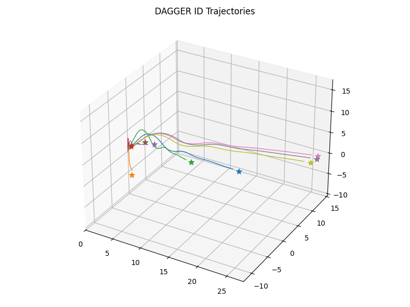

# Reinforcement Learning on Pieter Abbeel's helicopter as a Gymnasium Environment

<p align="center">
  
</p>

This project implements Pieter Abbeel and Stanford's(http://heli.stanford.edu) helicopter system as a custom continuous control Gymnasium environment and
evaluates few learning algorithms:

- **Behavior Cloning (BC)**
- **DAgger**
- **Proximal Policy Optimization (PPO)** *(coming soon)*
- **Soft Actor-Critic (SAC)** *(coming soon)*
- **Dreamer** *(coming soon)*

This repo includes the environment, PID expert controller, expert demonstrations dataset generation, learning algorithms.

---

## Directory Structure

```text
abbeel_heli/         # Helicopter dynamics, environments, PID controller, expert demo dataset generation, utilities
datasets/            # Expert demonstration dataset
models/              # Saved models for BC, DAgger
plots/               # Evaluation plots
bc.py                # Behavior Cloning training/evaluation
dagger.py            # DAgger training/evaluation
```

## Setup
Requires Python 3.10+.

## How to run
1. Generate expert demos dataset:
   ```bash
   python abbeel_heli/datasets/collect_expert.py
   ```
2. Train and eval Behavior Cloning:
   ```bash
   python bc.py train
   python bc.py eval
   ```
3. Train and eval DAgger:
   ```bash
   python bc.py train
   python dagger.py eval
   ```

## Author
Sri Rama Bandi (sbandi@umass.edu)